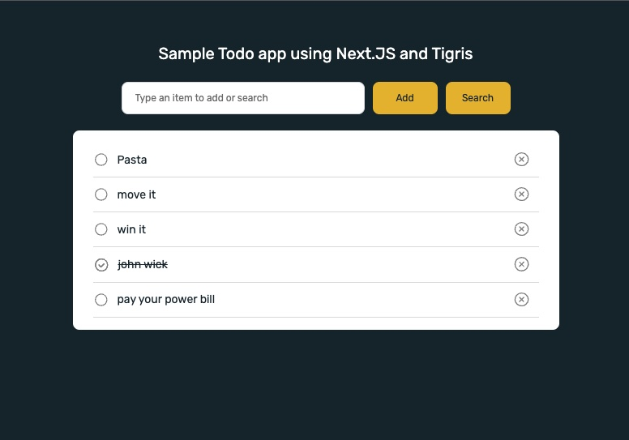

<a name="readme-top"></a>

[![Next][Next.js]][Next-url]
[![TypeScript][TypeScript]][TypeScript-url]
[![Vercel][Vercel]][Vercel-url]
[![Apache License][license-shield]][license-url]

# ⚡ Tigris and Next.js starter template

Tigris is a fully-managed developer data platform that offers a suite of 
databases and data services with a code-first approach, empowering you to 
build responsive applications without the hassle of infrastructure 
management and scaling complexities.

* **Database**: A fully-managed, serverless document database designed to 
  run applications at any scale. Offers native support for global 
  transactions, high availability, fault tolerance, data security and 
  database branching.
* **Search**: A unified, fully-managed platform that combines database, 
  full-text search and sync mechanism providing the easiest way 
  to build search capabilities into applications.

To learn more about Tigris, see [tigrisdata.com][tigris-url].

This template creates a simple todo app built on [Next.js][Next-url] and 
[Tigris][tigris-url] and deployed on [Vercel][Vercel-url].

#### Project demo

<a href="https://tigris-nextjs-starter-kit.vercel.app/">
    
</a>

https://tigris-nextjs-starter-kit.vercel.app/

# ⚙️ Deploying the app

All you need is a [Github](https://github.com), [Vercel][Vercel-url] and Tigris
account([sign up for a free account][signup-url]). Now, Hit "Deploy"
and follow instructions to deploy app to your Vercel account

[][Deploy-url]

:tada: All done. You should be able to use app on the URL provided by Vercel. Feel free to play around
or do a [code walkthrough](#code-walkthrough) next :tada:

> [Tigris integration](https://vercel.com/integrations/tigris) with Vercel will automatically fetch
access keys to populate [Environment Variables](.env.example) when deploying app.

<details>
<summary>2. Running Next.js server & Tigris dev environment on your local computer</summary>

## 📖 Running Next.js server & Tigris locally

### Prerequisites

1. Tigris installed on your dev computer
   1. For **macOS**: `brew install tigrisdata/tigris/tigris-cli`
   2. Other operating systems: [See installation instructions here](https://docs.tigrisdata.com/cli/installation)
2. Node.js version 16+

### Instructions

1. Clone this repo on your computer
```shell
git clone https://github.com/tigrisdata/tigris-vercel-starter
```
2. Install dependencies
```shell
cd tigris-vercel-starter
npm install
```
3. Start Tigris local development environment
```shell
tigris dev start
```
4. Run the Next.js server
```shell
npm run dev
```
>Note: This step will also initialize Tigris project and collections for app.

:tada: All done. You should be able to use app on `localhost:3000` in browser. Feel free to play 
around or do a [code walk-through](#code-walkthrough) next :tada:
</details>

# 👀 Code walkthrough

<details>
<summary> 📂 File structure</summary>

```text
├── package.json
├── lib
│   ├── tigris.ts
├── db
│   └── models
│       └── todoItems.ts
└── pages
    ├── index.tsx
    └── api
        ├── item
        │   ├── [id].ts
        └── items
            ├── index.ts
            └── search.ts
```
</details>

<details>
<summary> 🪢 Tigris schema definition</summary>

[db/models/todoItems.ts](db/models/todoItems.ts) - The to-do list app has a single collection
`todoItems` that stores the to-do items. This Collection gets automatically created/updated by the
[setup script](scripts/setup.ts). 
</details>

<details>
<summary> 🌐 Connecting to Tigris</summary>

[lib/tigris.ts](lib/tigris.ts) - Loads the environment variables you specified previously in creating a Vercel project
section and uses them to configure the Tigris client.
</details>

<details>
<summary> ❇️ API routes to access data in Tigris collection</summary>

All the Next.js API routes are defined under `pages/api/`. We have three files exposing endpoints: 

#### [`pages/api/items/index.ts`](pages/api/items/index.ts)

- `GET /api/items` to get an array of to-do items as Array<TodoItem>
- `POST /api/items` to add an item to the list

#### [`/pages/api/items/search.ts`](/pages/api/items/search.ts)

- `GET /api/items/search?q=query` to find and return items matching the given query

#### [`pages/api/item/[id].ts`](pages/api/item/[id].ts)

- `GET /api/item/{id}` to fetch an item
- `PUT /api/item/{id}` to update the given item
- `DELETE /api/item/[id]` to delete an item

</details>

# 🚀 Next steps

In a few steps, we learnt how to bootstrap a Next.js app using Tigris and 
deploy it on Vercel. Feel free to add more functionalities or customize App 
for your use-case and learn more about 
[Tigris][tigris-url]. 

# 🤝 Contributing

Contributions are what make the open source community such an amazing place to learn, inspire, and create.
Any contributions you make are **greatly appreciated**.

If you have a suggestion that would make this better, please fork the repo and create a pull request. 
You can also simply open an issue. Don't forget to give the project a star! 
Thanks again!

1. Fork the Project
2. Create your Feature Branch (`git checkout -b feature/AmazingFeature`)
3. Commit your Changes (`git commit -m 'Add some AmazingFeature'`)
4. Push to the Branch (`git push origin feature/AmazingFeature`)
5. Open a Pull Request

<p align="right">(<a href="#readme-top">back to top</a>)</p>


<!-- MARKDOWN LINKS & IMAGES -->
[TypeScript]: https://img.shields.io/badge/TypeScript-007ACC?style=for-the-badge&logo=typescript&logoColor=white
[TypeScript-url]: https://www.typescriptlang.org/
[Vercel]: https://img.shields.io/badge/vercel-F22F46?style=for-the-badge&logo=vercel&logoColor=white
[Vercel-url]: https://vercel.com/
[Deploy-url]: https://vercel.com/new/clone?repository-url=https%3A%2F%2Fgithub.com%2Ftigrisdata%2Ftigris-vercel-starter&project-name=todo-list-app-tigris&repo-name=todo-list-webapp-tigris&demo-title=My%20To-do%20list%20webapp&demo-description=A%20To-do%20list%20webapp%20using%20NextJS%20and%20Tigris&integration-ids=oac_Orjx197uMuJobdSaEpVv2Zn8
[Next.js]: https://img.shields.io/badge/next.js-000000?style=for-the-badge&logo=nextdotjs&logoColor=white
[Next-url]: https://nextjs.org/
[license-shield]: https://img.shields.io/github/license/tigrisdata/tigris-vercel-starter.svg?style=for-the-badge
[license-url]: LICENSE
[tigris-url]: https://www.tigrisdata.com/
[signup-url]: https://console.preview.tigrisdata.cloud/signup